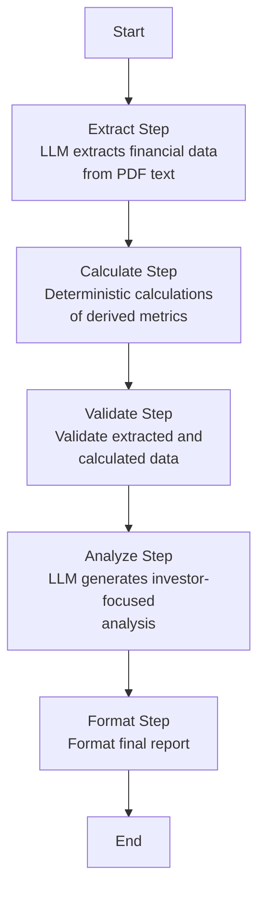

<div align="center">

# PSX Research Agent


A comprehensive web application for analyzing PSX stocks: technical analysis and financial statement analysis.

[Features](#features) • [Installation](#installation) • [Documentation](#api-endpoints) • [License](#license)

</div>

---

## Table of Contents

- [Features](#features)
- [Screenshots](#screenshots)
- [Project Structure](#project-structure)
- [Installation](#installation)
  - [Prerequisites](#prerequisites)
  - [Install uv](#install-uv)
  - [Install Dependencies](#install-dependencies)
- [Running](#running)
- [API Endpoints](#api-endpoints)
- [Configuration](#configuration)
- [Technical Analysis](#technical-analysis)
- [Financial Analysis](#financial-analysis)
  - [LangGraph Workflow](#langgraph-workflow)
- [Development](#development)
- [Troubleshooting](#troubleshooting)
- [Why uv?](#why-uv)
- [License](#license)

---

## Features

1. **Technical Analysis** - Comprehensive technical indicators and signals
2. **Financial Analysis** - Analysis of latest financial statements using LangGraph

---

## Screenshots

### Financial Analysis


*Financial analysis workflow showing LangGraph-powered multi-step analysis*

### Web Interface


*Main web interface for PSX stock analysis*

> **Note**: Replace `docs/imgs/web-ui.png` with an actual screenshot of your web interface when available.

---

## Project Structure

```
psx-research-agent/
├── app.py                    # FastAPI application
├── routes.py                 # API route handlers
├── price_repository.py       # Price data access
├── state_monitor.py          # State monitoring for financial analysis
├── technical/                # Technical analysis module
│   ├── analyzer.py           # Technical analyzer
│   ├── recommendation_engine.py  # Recommendation engine
│   ├── confidence_calculator.py  # Confidence calculation
│   ├── indicators/           # Technical indicator calculators
│   └── recommendation/       # Recommendation strategies
├── financial/                # Financial analysis module
│   ├── analyzers.py          # Financial analyzer
│   ├── langgraph/            # LangGraph workflow for financial analysis
│   ├── repositories/         # Result repositories
│   ├── services/             # PDF and financial services
│   └── config/               # Configuration
├── models/                   # Data models
│   ├── stock_analysis.py     # Stock analysis model
│   ├── financial_data.py     # Financial data model
│   └── base.py               # Base model utilities
├── templates/                # HTML templates
├── static/                   # Static files (JS, CSS)
├── data/                     # Data storage
│   ├── financial_statements/ # Downloaded PDFs
│   └── results/              # Analysis results
└── pyproject.toml           # Project dependencies
```

---

## Installation

### Prerequisites

- Python 3.10-3.12
- [uv](https://github.com/astral-sh/uv) - Fast Python package installer

### Install uv

```bash
curl -LsSf https://astral.sh/uv/install.sh | sh
```

Or with pip:

```bash
pip install uv
```

### Install Dependencies

From the root directory:

```bash
uv sync
```

This will install all dependencies defined in `pyproject.toml`.

---

## Running

### Start the Server

```bash
uv run uvicorn app:app --reload --host 0.0.0.0 --port 8000
```

Or with Python directly (if dependencies are installed):

```bash
python app.py
```

The web application will be available at `http://localhost:8000`

---

## API Endpoints

- `GET /` - Frontend page
- `POST /api/technical-analysis` - Perform technical analysis
- `POST /api/financial-analysis/check` - Check if analysis exists
- `POST /api/financial-analysis/run` - Start financial analysis
- `GET /api/financial-analysis/stream/{symbol}` - Stream analysis progress (SSE)
- `GET /api/financial-analysis/status/{symbol}` - Get analysis status
- `GET /api/financial-analysis/result/{symbol}` - Get final result
- `GET /docs` - Interactive API documentation (Swagger UI)

---

## Configuration

### Environment Variables

```bash
# OpenRouter API (for financial analysis)
export OPENROUTER_API_KEY="your-api-key"
```

---

## Technical Analysis

The technical analysis module provides comprehensive indicators:

- **Momentum Indicators**: RSI, MACD, Stochastic
- **Trend Indicators**: SMA, EMA, Trend Analysis, Ichimoku Cloud
- **Volatility Indicators**: Bollinger Bands, ATR
- **Volume Indicators**: Volume Ratio, OBV, VWAP
- **Support/Resistance**: Fibonacci Retracements
- **Pattern Recognition**: Candlestick Patterns

---

## Financial Analysis

The financial analysis uses LangGraph to orchestrate a multi-step workflow for analyzing financial statements.

### LangGraph Workflow



**Workflow Steps**:

1. **Extract** - LLM extracts structured financial data from PDF text (Income Statement, Balance Sheet, Cash Flow)
2. **Calculate** - Deterministic calculations of derived metrics (P/E, P/B, ROE, ROA, etc.)
3. **Validate** - Validate extracted and calculated data for consistency
4. **Analyze** - LLM generates investor-focused analysis based on extracted data and calculated metrics
5. **Format** - Format the final analysis report

The workflow maintains state between steps and provides real-time progress updates via Server-Sent Events (SSE).

**Why LangGraph**:

- Explicit state management with `TypedDict` for type safety
- Better handling of multi-step processes where deterministic calculations are needed between LLM calls
- State persistence allows debugging and recovery from failures
- More flexible error handling and conditional routing

---

## Development

### Code Structure

- **No unnecessary abstractions** - Direct classes and functions
- **Flat structure** - Easy to navigate
- **Small functions** - Functions are kept under 50 lines
- **Clear organization** - Logical grouping by feature

### Adding New Technical Indicators

1. Create indicator calculator in `technical/indicators/`
2. Add to `technical/analyzer.py`
3. Update signal generation if needed

### Adding New Financial Metrics

1. Update LangGraph workflow steps in `financial/langgraph/workflow_steps/`
2. Add calculations in `calculate_step.py`
3. Update validation in `validate_step.py`

---

## Troubleshooting

### "Module not found" errors

Ensure dependencies are installed:

```bash
uv sync
```

### "OPENROUTER_API_KEY is required"

Set the environment variable:

```bash
export OPENROUTER_API_KEY="your-api-key"
```

### "Address already in use"

Kill existing processes on port 8000:

```bash
lsof -ti:8000 | xargs kill -9
```

---

## Why uv?

- **No activation needed**: Just use `uv run` - it automatically uses the virtual environment
- **Faster**: Installs packages much faster than pip
- **Simpler workflow**: No more `source venv/bin/activate` commands
- **Automatic management**: Creates and manages virtual environments for you

---

## License

This project is licensed under the MIT License - see the [LICENSE](LICENSE) file for details.

---

<div align="center">

**Made with ❤️ for PSX Stock Analysis**

[Report Bug](https://github.com/yourusername/psx-research-agent/issues) • [Request Feature](https://github.com/yourusername/psx-research-agent/issues) • [Documentation](https://github.com/yourusername/psx-research-agent#readme)

</div>
