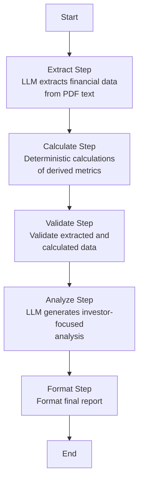

# PSX Research Agent

A research-oriented toolchain for analyzing PSX stocks: technical + financial analysis, daily summaries, monitors, and alerts.

## Project Structure

This project is organized as a monorepo with 3 packages:

```
psx/
├── packages/
│   ├── analysis/                    # Shared analysis package (open source-able)
│   │   ├── pyproject.toml
│   │   └── psx_analysis/
│   │       ├── technical_analysis/  # Technical analysis module
│   │       │   ├── analyzers.py
│   │       │   └── indicators/      # All technical indicators
│   │       ├── financial_analysis/  # Financial analysis module
│   │       │   ├── analyzers.py
│   │       │   ├── langgraph/       # LangGraph workflow
│   │       │   └── pdfplumber_extractor.py
│   │       ├── domain/              # Domain models and interfaces
│   │       │   ├── entities/
│   │       │   ├── repositories/
│   │       │   └── services/
│   │       └── models/              # Shared data models
│   │
│   ├── web/                         # Web package (open source-able)
│   │   ├── pyproject.toml
│   │   ├── app.py                   # FastAPI application
│   │   ├── templates/               # HTML templates
│   │   ├── static/                  # Static assets
│   │   └── psx_web/
│   │       └── handlers/            # Request handlers
│
├── .gitignore
└── README.md
```

## Package Dependencies

- **analysis**: Pure analysis logic,
- **web**: Depends on `psx-analysis`

## Installation

### Prerequisites

- Python 3.10+
- [uv](https://github.com/astral-sh/uv) - Fast Python package installer

### Install uv

```bash
curl -LsSf https://astral.sh/uv/install.sh | sh
```

Or with pip:
```bash
pip install uv
```

### Install Packages

This project uses `uv` workspace configuration. Install all packages from the root directory:

```bash
# From the root directory, sync all workspace packages
uv sync
```


```bash
# may be use this if above doesnt works?
uv pip install -e packages/analysis -e packages/web
```


This will install `psx-analysis`, `psx-web`, and `psx-cli` packages together, resolving local dependencies correctly.

**Note on Python version**: The packages require Python 3.10-3.12.

## Running

### Web Application

After installing packages together, use `uv run`:

```bash
cd packages/web
uv run python app.py
```

Or with uvicorn:
```bash
cd packages/web
uv run uvicorn app:app --host 0.0.0.0 --port 8000
```

**Note**: This project uses `uv` workspace configuration. After running `uv sync` from the root directory, `uv run` will work correctly with local package dependencies.

The web application will be available at `http://localhost:8000`

## Analysis Package

### Technical Analysis

The analysis package provides comprehensive technical analysis with the following indicators:

- **Momentum Indicators**:
  - RSI (Relative Strength Index) - 14-period
  - MACD (Moving Average Convergence Divergence)
  - Stochastic Oscillator

- **Trend Indicators**:
  - SMA (Simple Moving Average) - 20, 50, 200 periods
  - EMA (Exponential Moving Average)
  - Trend Analysis (Uptrend/Downtrend/Bullish/Bearish/Neutral)
  - Ichimoku Cloud

- **Volatility Indicators**:
  - Bollinger Bands
  - ATR (Average True Range)

- **Volume Indicators**:
  - Volume Ratio
  - OBV (On-Balance Volume)
  - VWAP (Volume Weighted Average Price)

- **Support/Resistance**:
  - Fibonacci Retracements
  - Support/Resistance Levels

- **Pattern Recognition**:
  - Candlestick Patterns

### Financial Analysis with LangGraph

The financial analysis uses LangGraph to orchestrate a multi-step workflow for analyzing financial statements. Unlike LangChain, LangGraph provides:

- **Explicit State Management**: Each step maintains and updates a shared state
- **Multi-step Workflows**: Complex workflows with conditional logic
- **State Persistence**: Save state between steps for debugging and recovery
- **Better Error Handling**: Graceful error handling and recovery
- **Deterministic Calculations**: Mix LLM calls with deterministic calculations seamlessly

#### LangGraph Workflow



**Workflow Steps**:

1. **Extract**: LLM extracts structured financial data from PDF text (Income Statement, Balance Sheet, Cash Flow)
2. **Calculate**: Deterministic calculations of derived metrics (P/E, P/B, ROE, ROA, etc.)
3. **Validate**: Validate extracted and calculated data for consistency
4. **Analyze**: LLM generates investor-focused analysis based on extracted data and calculated metrics
5. **Format**: Format the final analysis report

**Why LangGraph over LangChain**:

- LangChain chains are too linear and don't support complex stateful workflows
- LangGraph provides explicit state management with `TypedDict` for type safety
- Better handling of multi-step processes where deterministic calculations are needed between LLM calls
- State persistence allows debugging and recovery from failures
- More flexible error handling and conditional routing

## Web Package

FastAPI-based web application providing REST API endpoints for technical and financial analysis. Features real-time Server-Sent Events (SSE) for financial analysis progress updates. The web package has no Google Sheets dependencies and can be open sourced independently.

**API Endpoints**:
- `POST /api/technical-analysis` - Perform technical analysis
- `POST /api/financial-analysis/check` - Check if analysis exists
- `POST /api/financial-analysis/run` - Start financial analysis
- `GET /api/financial-analysis/stream/{symbol}` - Stream analysis progress (SSE)
- `GET /api/financial-analysis/status/{symbol}` - Get analysis status
- `GET /api/financial-analysis/result/{symbol}` - Get final result

## Configuration

### Environment Variables

```bash
# OpenRouter API (for financial analysis)
export OPENROUTER_API_KEY="your-api-key"
```


## Development

### Adding New Technical Indicators

1. Create indicator calculator in `packages/analysis/psx_analysis/technical_analysis/indicators/`
2. Add to `__init__.py` exports
3. Integrate in `analyzers.py`

### Adding New Financial Metrics

1. Update LangGraph workflow steps in `packages/analysis/psx_analysis/financial_analysis/langgraph/workflow_steps/`
2. Add calculations in `calculate_step.py`
3. Update validation in `validate_step.py`

## Troubleshooting

### "Module not found" errors

Ensure all packages are installed:
```bash
uv pip install -e packages/analysis
uv pip install -e packages/web  # or packages/cli
```

### "OPENROUTER_API_KEY is required" (Web/Financial Analysis)

Set the environment variable:
```bash
export OPENROUTER_API_KEY="your-api-key"
```


## Why uv?

- **No activation needed**: Just use `uv run` - it automatically uses the virtual environment
- **Faster**: Installs packages much faster than pip
- **Simpler workflow**: No more `source venv/bin/activate` commands
- **Automatic management**: Creates and manages virtual environments for you
